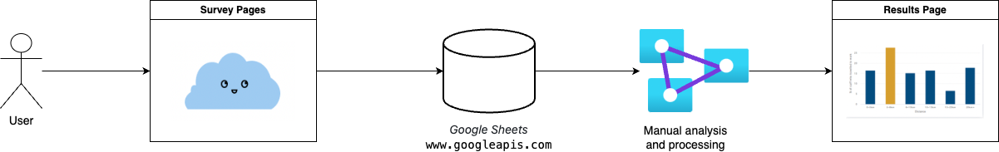

<h1 align="center">
  Council Emissions Calculator
</h1>
<p align="center">
  Civic Maker's Council Carbon Emissions Calculator project
</p>

<p align="center">
  <a href="https://github.com/CodeforAustralia/council-emissions-calculator/pulls"></a>
  <a href="https://github.com/CodeforAustralia/council-emissions-calculator/commits/staging"></a>
  <a href="https://github.com/CodeforAustralia/council-emissions-calculator/graphs/contributors"></a>
</p>


## Overview

|Category|Details|
|--------|-------|
| Purpose | Provide a source of information that facilitates the decision process for councils to become more sustainable |
| Custodian | Civic Makers |
| Slack | [\#civic-makers-climatechange](https://codeforaustralia.slack.com/archives/C01CXCQPF8V) |
| Tech Stack | Next JS, Chakra UI, Google Sheets |
| Design | https://www.figma.com/file/Y42AKuHDW46LiLDaTOs6sM/Heroes-carbon-calculator-designs?node-id=978%3A54391&t=jSZfGy4RjwTVhtH4-1 |
| Staging Endpoint | http://council-emissions-calculator-spike-flax.vercel.app/ |
| Prod Endpoint | https://seechange.codeforaustralia.org/ |

## Table of Contents

- [Project Goals](#project-goals)
- [System Diagram](#system-diagram)
- [Getting Started](#getting-started)
- [Development](#getting-started)
- [Resourses](#resourses)
- [Dependencies](#dependencies)

## Project Goals

- Provide councils a tool to assess their impact on the environment.
- Provide councils with inspirations and next steps to have a more sustainable way of workingand engage communities in initiatives that are favorable for the environment.
- Provide a source of information that facilitates the decision process for councils to become more sustainable.

To learn more about this project, check out our [project planning](https://docs.google.com/document/d/1h5r1AfbQC8Azy_cdGHGBGOJwSxSqvt0cHKd5MmSd7qo/edit#heading=h.fw4lq2wclkt9) and [trello project board.](https://trello.com/b/iPHuVc0J/civic-makers-2023)

## System Diagram



## Getting Started

1. Clone the repository to your local machine.

2. Install dependencies using your preferred package manager:

```
npm install
```

or

```
yarn install
```

3. Run the development server:

```
npm run dev
```

or

```
yarn dev
```

4. Open [http://localhost:3000](http://localhost:3000) in your browser to view the carbon emission survey website locally.

## Development

We have 2 endpoints: [Staging](http://council-emissions-calculator-spike-flax.vercel.app/) and [Production](https://seechange.codeforaustralia.org/).

Please refer to [this doc](https://docs.github.com/en/get-started/quickstart/fork-a-repo) for instructions on how to fork this repo and contributing your changes.

**N.B:** Please note well that the *default branch* for this repo is the **staging** branch, not the *main* branch; Any new pull request raised for this repo will have its changes pushed to **staging** branch by default when the PR is approved and merged.

The **staging** branch is hosted on our [Staging endpoint](http://council-emissions-calculator-spike-flax.vercel.app/). 

The **main** branch is hosted on our [Production endpoint](https://seechange.codeforaustralia.org/).


## Resourses

To learn more about Next.js, take a look at the following resources:
     
- [Next.js Documentation](https://nextjs.org/docs) - learn about Next.js features and API.
- [Learn Next.js](https://nextjs.org/learn) - an interactive Next.js tutorial.

You can check out [the Next.js GitHub repository](https://github.com/vercel/next.js/) - your feedback and contributions are welcome!

## Dependencies
  
- Google Sheets as database
- Google Sheets to process form responses and calculate emissions
- Chakra for UI framework
- Highcharts to build charts in report
- Vercel as hosting platform
